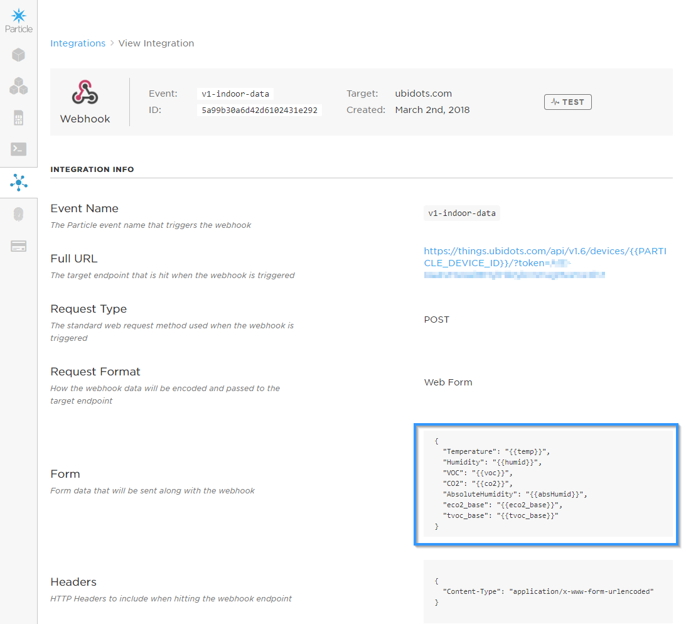

# rumluft-indoor-firmware
The indoor room sensor firmware based on the Particle IoT platform

# Setup
## Hardware

- Particle Photon (https://www.adafruit.com/product/2721)
- Adafruit SGP30 (https://www.adafruit.com/product/3709)
- Adafruit SHT31-D (https://www.adafruit.com/product/2857)

## Particle Cloud
Once the firmware is programmed and connected to WiFi, the device starts to send measurement data to the particle cloud.

Events are forwarded to Ubidots with a Webhook integration, so that they can be stored and visualized:

## Ubidots
Setup the matching variables for your device in Ubidots:

After that, the data can be visualized in various dashboards:

# SGP30 Humidity Compensation
The SGP30 features an on-chip humidity compensation for the air quality signals (CO2eq and TVOC) and sensor raw signals (H2-signal and Ethanol_signal).
To use the on-chip humidity compensation an absolute humidity value from an external humidity sensor SHT31-D is used.

The approximation formula for absolute humidity [mg/m^3] from Sensirion SGP30 driver integration guide chapter 3.15 has been integrated.

# SGP30 Baseline Correction Algorithm
The SGP30 also provides the possibility to read and write the baseline values of the baseline correction algorithm. This feature is used to save the baseline in regular intervals on an external non-volatile memory and restore it after a new power-up or softreset of the sensor.

If no stored baseline is available after initializing the baseline algorithm, the sensor has to run for 12 hours until the baseline can be stored.
This will ensure an optimal behavior for subsequent startups. Reading out the baseline prior should be avoided unless a valid baseline is restored first.
Once the baseline is properly initialized or restored, the current baseline value should be stored approximately once per hour. While the sensor is off, baseline values are valid for a maximum of seven days.

When the 12h burn-in is completed, call the setBaseline function from the Particle console. From there on, the baseline is persisted each hour on the internal EEPROM and restored at startup.
